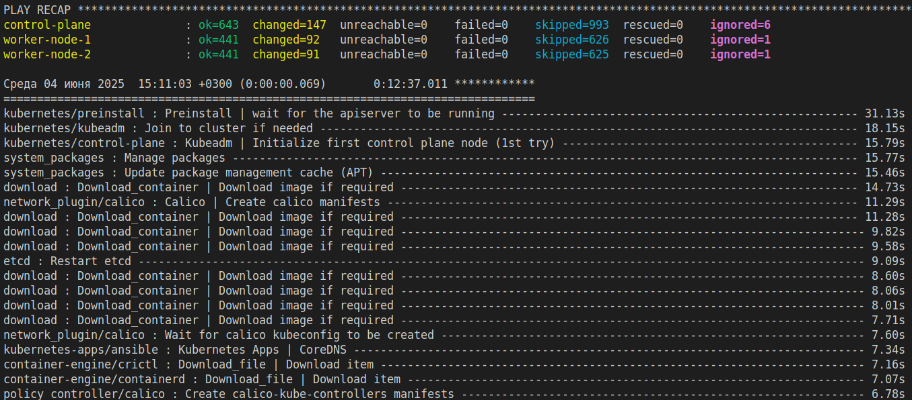

# Дипломный практикум в Yandex.Cloud "Макарцев Александр Владимирович"
- [Дипломный практикум в Yandex.Cloud "Макарцев Александр Владимирович"](#дипломный-практикум-в-yandexcloud-макарцев-александр-владимирович)
  - [Цели:](#цели)
  - [Этапы выполнения:](#этапы-выполнения)
    - [Создание облачной инфраструктуры](#создание-облачной-инфраструктуры)
    - [Решение](#решение)
    - [Создание Kubernetes кластера](#создание-kubernetes-кластера)
    - [Решение](#решение-1)
    - [Создание тестового приложения](#создание-тестового-приложения)
    - [Решение](#решение-2)
    - [Подготовка cистемы мониторинга и деплой приложения](#подготовка-cистемы-мониторинга-и-деплой-приложения)
    - [Решение](#решение-3)
    - [Деплой инфраструктуры в terraform pipeline](#деплой-инфраструктуры-в-terraform-pipeline)
    - [Установка и настройка CI/CD](#установка-и-настройка-cicd)
  - [Что необходимо для сдачи задания?](#что-необходимо-для-сдачи-задания)

**Перед началом работы над дипломным заданием изучите [Инструкция по экономии облачных ресурсов](https://github.com/netology-code/devops-materials/blob/master/cloudwork.MD).**

---
## Цели:

1. Подготовить облачную инфраструктуру на базе облачного провайдера Яндекс.Облако.
2. Запустить и сконфигурировать Kubernetes кластер.
3. Установить и настроить систему мониторинга.
4. Настроить и автоматизировать сборку тестового приложения с использованием Docker-контейнеров.
5. Настроить CI для автоматической сборки и тестирования.
6. Настроить CD для автоматического развёртывания приложения.

---
## Этапы выполнения:


### Создание облачной инфраструктуры

Для начала необходимо подготовить облачную инфраструктуру в ЯО при помощи [Terraform](https://www.terraform.io/).

Особенности выполнения:

- Бюджет купона ограничен, что следует иметь в виду при проектировании инфраструктуры и использовании ресурсов;
Для облачного k8s используйте региональный мастер(неотказоустойчивый). Для self-hosted k8s минимизируйте ресурсы ВМ и долю ЦПУ. В обоих вариантах используйте прерываемые ВМ для worker nodes.

Предварительная подготовка к установке и запуску Kubernetes кластера.

1. Создайте сервисный аккаунт, который будет в дальнейшем использоваться Terraform для работы с инфраструктурой с необходимыми и достаточными правами. Не стоит использовать права суперпользователя
2. Подготовьте [backend](https://developer.hashicorp.com/terraform/language/backend) для Terraform:  
   а. Рекомендуемый вариант: S3 bucket в созданном ЯО аккаунте(создание бакета через TF)
   б. Альтернативный вариант:  [Terraform Cloud](https://app.terraform.io/)
3. Создайте конфигурацию Terrafrom, используя созданный бакет ранее как бекенд для хранения стейт файла. Конфигурации Terraform для создания сервисного аккаунта и бакета и основной инфраструктуры следует сохранить в разных папках.
4. Создайте VPC с подсетями в разных зонах доступности.
5. Убедитесь, что теперь вы можете выполнить команды `terraform destroy` и `terraform apply` без дополнительных ручных действий.
6. В случае использования [Terraform Cloud](https://app.terraform.io/) в качестве [backend](https://developer.hashicorp.com/terraform/language/backend) убедитесь, что применение изменений успешно проходит, используя web-интерфейс Terraform cloud.

Ожидаемые результаты:

1. Terraform сконфигурирован и создание инфраструктуры посредством Terraform возможно без дополнительных ручных действий, стейт основной конфигурации сохраняется в бакете или Terraform Cloud
2. Полученная конфигурация инфраструктуры является предварительной, поэтому в ходе дальнейшего выполнения задания возможны изменения.

### Решение

Создаем сервисный аккаунт, добавляем права storage.editor и создаем ключ к хранилищу  
Файл ```bucket.tf```
```go
# Создание сервисного аккаунта
resource "yandex_iam_service_account" "sa" {
  name = "sa-for-s3"
}

# Назначение роли сервисному аккаунту
resource "yandex_resourcemanager_folder_iam_member" "sa-editor" {
  folder_id = var.folder_id
  role      = "storage.editor"
  member    = "serviceAccount:${yandex_iam_service_account.sa.id}"
}

# Создание статического ключа доступа
resource "yandex_iam_service_account_static_access_key" "sa-static-key" {
  service_account_id = yandex_iam_service_account.sa.id
}
```

Файл ```providers.tf```
```go
terraform {
  required_providers {
    yandex = {
      source = "yandex-cloud/yandex"
    }
  }
  required_version = ">= 1.6.4"
}

provider "yandex" {
  token     = var.token
  cloud_id  = var.cloud_id
  folder_id = var.folder_id
  zone      = var.default_zone
}
```

Файл ```variables.tf```
```go
variable "token" {
  type        = string
  description = "OAuth-token; https://cloud.yandex.ru/docs/iam/concepts/authorization/oauth-token"
}

variable "cloud_id" {
  type        = string
  description = "https://cloud.yandex.ru/docs/resource-manager/operations/cloud/get-id"
}

variable "folder_id" {
  type        = string
  description = "https://cloud.yandex.ru/docs/resource-manager/operations/folder/get-id"
}

variable "default_zone" {
  type        = string
  default     = "ru-central1-a"
  description = "https://cloud.yandex.ru/docs/overview/concepts/geo-scope"
}     
```

Создание сервисного аккаунта и бакета вынесено в отдельную папку [bucket](./bucket/)

Для создания бакета выведем шаблон, который будет класться в папку [terraform](./terraform/), в файл ```providers.tf```
```go
# Конфигурация для бэкэнда terraform к S3 бакета
resource "local_file" "backend" {
  content  = <<EOT
  provider "yandex" {
  cloud_id  = var.cloud_id
  folder_id = var.folder_id
  zone      = var.default_zone
  token     = var.token
}
terraform {
  required_providers {
    yandex = {
      source = "yandex-cloud/yandex"
    }
  }
  backend "s3" {
    endpoints = {
      s3 = "https://storage.yandexcloud.net"
    }
    bucket     = "bucket-amakartsev-diplom"
    region     = "ru-central1"
    key        = "terraform.tfstate"
    access_key = "${yandex_iam_service_account_static_access_key.sa-static-key.access_key}"
    secret_key = "${yandex_iam_service_account_static_access_key.sa-static-key.secret_key}"

    skip_region_validation      = true
    skip_credentials_validation = true
    skip_requesting_account_id  = true # необходимая опция при описании бэкенда для Terraform версии 1.6.1 и старше.
    skip_s3_checksum            = true # необходимая опция при описании бэкенда для Terraform версии 1.6.3 и старше.
  }
  required_version = ">= 1.6.4"
}
EOT
  filename = "../terraform/providers.tf"
}
```

Проделываемые операции
```sh
terraform init  # Инициализация конфигурации
```
```sh
terraform plan  # Показывает план изменений
```
```sh
terraform apply # Применяет изменения
```

Создание VPC с подсетями в различных зонах
```go
# Создание сети
resource "yandex_vpc_network" "my_vpc" {
  name = var.VPC_name
}

# Создание подсетей
resource "yandex_vpc_subnet" "public_subnet" {
  count = length(var.public_subnet_zones)
  name  = "${var.public_subnet_name}-${var.public_subnet_zones[count.index]}"
  v4_cidr_blocks = [
    cidrsubnet(var.public_v4_cidr_blocks[0], 4, count.index)
  ]
  zone       = var.public_subnet_zones[count.index]
  network_id = yandex_vpc_network.my_vpc.id
}
```

Добавляем в ```variables.tf``` помимо базовых значени, следующее:
```go
# Переменные для сети
variable "VPC_name" {
  type        = string
  default     = "my-vpc"
}

# Переменные для подсетей
variable "public_subnet_name" {
  type        = string
  default     = "public"
}

variable "public_v4_cidr_blocks" {
  type        = list(string)
  default     = ["192.168.1.0/24"]
}

variable "subnet_zone" {
  type        = string
  default     = "ru-central1"
}

variable "public_subnet_zones" {
  type    = list(string)
  default = ["ru-central1-a", "ru-central1-b",  "ru-central1-d"]
}
```

Дополнительно добавим ```outputs.tf```
```go
# Network Outputs
output "vpc" {
  value = {
    name = yandex_vpc_network.my_vpc.name
    id   = yandex_vpc_network.my_vpc.id
  }
  description = "VPC network details"
}

output "public_subnets" {
  value = [ 
    for subnet in yandex_vpc_subnet.public_subnet : {
      id         = subnet.id
      name       = subnet.name
      cidr_block = subnet.v4_cidr_blocks[0]
      zone       = subnet.zone
    }
  ]
  description = "Details of all public subnets"
}
```

Проделываемые операции
```sh
terraform init  # Инициализация конфигурации
```
```sh
terraform plan  # Показывает план изменений
```
```sh
terraform apply # Применяет изменения
```

```terraform destroy``` и ```terraform apply``` инициализируются без дополнительных действий

Инициализация из папки ```bucket```

Инициализация из папки ```terraform```

Ресурсы, которые создались в ```yandex cloud```

Бекэнд конфигурация сохраняется в бакет


---
### Создание Kubernetes кластера

На этом этапе необходимо создать [Kubernetes](https://kubernetes.io/ru/docs/concepts/overview/what-is-kubernetes/) кластер на базе предварительно созданной инфраструктуры.   Требуется обеспечить доступ к ресурсам из Интернета.

Это можно сделать двумя способами:

1. Рекомендуемый вариант: самостоятельная установка Kubernetes кластера.  
   а. При помощи Terraform подготовить как минимум 3 виртуальных машины Compute Cloud для создания Kubernetes-кластера. Тип виртуальной машины следует выбрать самостоятельно с учётом требовании к производительности и стоимости. Если в дальнейшем поймете, что необходимо сменить тип инстанса, используйте Terraform для внесения изменений.  
   б. Подготовить [ansible](https://www.ansible.com/) конфигурации, можно воспользоваться, например [Kubespray](https://kubernetes.io/docs/setup/production-environment/tools/kubespray/)  
   в. Задеплоить Kubernetes на подготовленные ранее инстансы, в случае нехватки каких-либо ресурсов вы всегда можете создать их при помощи Terraform.
2. Альтернативный вариант: воспользуйтесь сервисом [Yandex Managed Service for Kubernetes](https://cloud.yandex.ru/services/managed-kubernetes)  
  а. С помощью terraform resource для [kubernetes](https://registry.terraform.io/providers/yandex-cloud/yandex/latest/docs/resources/kubernetes_cluster) создать **региональный** мастер kubernetes с размещением нод в разных 3 подсетях      
  б. С помощью terraform resource для [kubernetes node group](https://registry.terraform.io/providers/yandex-cloud/yandex/latest/docs/resources/kubernetes_node_group)
  
Ожидаемый результат:

1. Работоспособный Kubernetes кластер.
2. В файле `~/.kube/config` находятся данные для доступа к кластеру.
3. Команда `kubectl get pods --all-namespaces` отрабатывает без ошибок.

### Решение

Добавим в terraform 1 мастер ноду и 2 воркера в ```infrastructure.tf```
```go
# Мастер нода
resource "yandex_compute_instance" "master-node" {
  name            = var.master_name
  platform_id     = var.platform
  zone            = var.public_subnet_zones[0]
  resources {
    cores         = var.master_core
    memory        = var.master_memory
    core_fraction = var.master_core_fraction
  }

  boot_disk {
    initialize_params {
      image_id = var.image_id
      size     = var.master_disk_size
    }
  }

  scheduling_policy {
    preemptible = var.scheduling_policy
  }

  network_interface {
    subnet_id = yandex_vpc_subnet.public_subnet[0].id
    nat       = var.nat
  }

  metadata = {
    user-data          = data.template_file.cloudinit.rendered
    serial-port-enable = var.vm_serial_port_enable
  }
}

# Воркер нода
resource "yandex_compute_instance" "worker" {
  count           = var.worker_count
  name            = "worker-node-${count.index + 1}"
  platform_id     = var.worker_platform
  zone = var.public_subnet_zones[count.index]
  resources {
    cores         = var.worker_cores
    memory        = var.worker_memory
    core_fraction = var.worker_core_fraction
  }

  boot_disk {
    initialize_params {
      image_id = var.image_id
      size     = var.worker_disk_size
    }
  }

  scheduling_policy {
    preemptible = var.scheduling_policy
  }

  network_interface {
    subnet_id = yandex_vpc_subnet.public_subnet[count.index].id
    nat       = var.nat
  }

  metadata = {
    user-data          = data.template_file.cloudinit.rendered
    serial-port-enable = var.vm_serial_port_enable
  }
}
```

Добавление в ```variables.tf```
```go
# Переменные для мастер ноды
variable "master_name" {
  type        = string
  default     = "control-plane"
}

variable "platform" {
  type        = string
  default     = "standard-v1"
}

variable "master_core" {
  type        = number
  default     = "4"
}

variable "master_memory" {
  type        = number
  default     = "8"
}

variable "master_core_fraction" {
  description = "guaranteed vCPU, for yandex cloud - 20, 50 or 100 "
  type        = number
  default     = "20"
}

variable "master_disk_size" {
  type        = number
  default     = "50"
}

variable "scheduling_policy" {
  type        = bool
  default     = "true"
}

# Переменные для воркер нод
variable "worker_count" {
  type        = number
  default     = "2"
}

variable "worker_platform" {
  type        = string
  default     = "standard-v1"
}

variable "worker_cores" {
  type        = number
  default     = "4"
}

variable "worker_memory" {
  type        = number
  default     = "2"
}

variable "worker_core_fraction" {
  description = "guaranteed vCPU, for yandex cloud - 20, 50 or 100 "
  type        = number
  default     = "20"
}

variable "worker_disk_size" {
  type        = number
  default     = "50"
}

variable "nat" {
  type        = bool
  default     = "true"
}

# Общие переменные для ВМ
variable "image_id" {
  type        = string
  default     = "fd83imruae299cbehbsb"
}
```

Добавление ```cloud-init.yml```
```yml
#cloud-config
users:
  - name: ${username}
    groups: sudo
    shell: /bin/bash
    sudo: ['ALL=(ALL) NOPASSWD:ALL']
    ssh_authorized_keys:
      - ${ssh_public_key}
package_update: true
package_upgrade: false
packages: ${packages}
```

```variables.tf``` для cloud-config
```go
# Для cloud-init.yml
variable "username" {
  description = "name of predefined user on VM"
  default     = "cloud-alex"
  type        = string
}

variable "ssh_public_key" {
  type        = string
  description = "Location of SSH public key."
  default     = "/home/alex/.ssh/id_ed25519.pub"
}

variable "vm_serial_port_enable" {
  type        = bool
  default     = true
}

variable "packages" {
  type    = list(string)
  default = ["nano", "mc"]
  description = "Packages to install on vm creates"
}
```

Добавим ```outputs.tf``` для ВМ
```go
# Master Node Outputs
output "master_node" {
  value = {
    name        = yandex_compute_instance.master-node.name
    external_ip = yandex_compute_instance.master-node.network_interface[0].nat_ip_address
    internal_ip = yandex_compute_instance.master-node.network_interface[0].ip_address
  }
  description = "Master node details"
}

# Worker Nodes Outputs
output "worker_nodes" {
  value = [ 
    for worker in yandex_compute_instance.worker : {
      name        = worker.name
      external_ip = worker.network_interface[0].nat_ip_address
      internal_ip = worker.network_interface[0].ip_address
    }
  ]
  description = "Worker nodes details"
}
```

Клонирование ```Kubespray```
```sh
git clone https://github.com/kubernetes-sigs/kubespray
```

Установка pip и зависимостей для дальнейшей прокатки ansible
```sh
sudo apt install python3-pip python3-venv
python3 -m venv .venv
source .venv/bin/activate 
pip3 install -r requirements.txt
```

Запуск для прокатки ```Kubespray``` (inventory.yaml формируется автоматически за счёт шаблона [inventory.yml.tftpl](./templates/inventory.yml.tftpl) и выводу из [ansible.tf](./terraform/ansible.tf))
```sh
ansible-playbook -i /home/alex/Documents/devops-diploma/terraform/inventory.yml cluster.yml -b -v -u cloud-alex
```

Вывод после прокатки ```Kubespray```

Вывод ```kube-config```

Вывод от ```kubectl```


---
### Создание тестового приложения

Для перехода к следующему этапу необходимо подготовить тестовое приложение, эмулирующее основное приложение разрабатываемое вашей компанией.

Способ подготовки:

1. Рекомендуемый вариант:  
   а. Создайте отдельный git репозиторий с простым nginx конфигом, который будет отдавать статические данные.  
   б. Подготовьте Dockerfile для создания образа приложения.  
2. Альтернативный вариант:  
   а. Используйте любой другой код, главное, чтобы был самостоятельно создан Dockerfile.

Ожидаемый результат:

1. Git репозиторий с тестовым приложением и Dockerfile.
2. Регистри с собранным docker image. В качестве регистри может быть DockerHub или [Yandex Container Registry](https://cloud.yandex.ru/services/container-registry), созданный также с помощью terraform.

### Решение

Создан [репозиторий](https://github.com/MakarAlexander/nginx-static) со статической страницей nginx, которая создается через ```Dockerfile``` на базе ```nginx:latest```

Локальная проверка ```nginx```

Добавление сборки в [```docker hub```](https://hub.docker.com/r/makartsewalex98/static-nginx/tags)


---
### Подготовка cистемы мониторинга и деплой приложения

Уже должны быть готовы конфигурации для автоматического создания облачной инфраструктуры и поднятия Kubernetes кластера.  
Теперь необходимо подготовить конфигурационные файлы для настройки нашего Kubernetes кластера.

Цель:
1. Задеплоить в кластер [prometheus](https://prometheus.io/), [grafana](https://grafana.com/), [alertmanager](https://github.com/prometheus/alertmanager), [экспортер](https://github.com/prometheus/node_exporter) основных метрик Kubernetes.
2. Задеплоить тестовое приложение, например, [nginx](https://www.nginx.com/) сервер отдающий статическую страницу.

Способ выполнения:
1. Воспользоваться пакетом [kube-prometheus](https://github.com/prometheus-operator/kube-prometheus), который уже включает в себя [Kubernetes оператор](https://operatorhub.io/) для [grafana](https://grafana.com/), [prometheus](https://prometheus.io/), [alertmanager](https://github.com/prometheus/alertmanager) и [node_exporter](https://github.com/prometheus/node_exporter). Альтернативный вариант - использовать набор helm чартов от [bitnami](https://github.com/bitnami/charts/tree/main/bitnami).

### Решение

Установка мониторинга через helm. Сначала требуется установить ```helm``` на control-plane ноду
```sh
curl https://raw.githubusercontent.com/helm/helm/master/scripts/get-helm-3 | bash
```
Создаем отдельное пространстов имен для мониторинга
```sh
kubectl create namespace project
```
Добавляем репозиторий helm c prometheus
```sh
helm repo add prometheus-community https://prometheus-community.github.io/helm-charts
```
Устанавливаем kube-prometheus-stack (установка Prometheus, Grafana, Alertmanager, node-exporter и kube-state-metrics)
```sh
helm install prometheus prometheus-community/kube-prometheus-stack -n project
```

Добавление ```ingress``` и его установка
```sh
helm repo add ingress-nginx https://kubernetes.github.io/ingress-nginx
```
```sh
helm install ingress-nginx ingress-nginx/ingress-nginx -n project
```

Пришлось добавить application-load-balancer.tf  и нужно изменить конфигурацию nginx-ingress
```sh
helm upgrade ingress-nginx ingress-nginx/ingress-nginx -n project \
  --set controller.service.type=NodePort \
  --set controller.service.nodePorts.http=30080
```
Деплой приложения из образа makartsewalex98/static-nginx:init, деплой сущности ингресс и создание сервисной учетной записи для CI/CD GitHub Actions
```sh
kubectl apply -f deployment.yml
kubectl apply -f ingress.yml
kubectl apply -f sa_for_github.yml
```
Требуется поменять DNS,cоздаем A-записи для домена, приложения и мониторинга, привяжу их к IP балансировщика

Проверка ```grafana``` на 80 порту

Проверка ```дашборда``` на предмет метрик k8s

Проверка ```nginx``` на 80 порту


### Деплой инфраструктуры в terraform pipeline

1. Если на первом этапе вы не воспользовались [Terraform Cloud](https://app.terraform.io/), то задеплойте и настройте в кластере [atlantis](https://www.runatlantis.io/) для отслеживания изменений инфраструктуры. Альтернативный вариант 3 задания: вместо Terraform Cloud или atlantis настройте на автоматический запуск и применение конфигурации terraform из вашего git-репозитория в выбранной вами CI-CD системе при любом комите в main ветку. Предоставьте скриншоты работы пайплайна из CI/CD системы.

Ожидаемый результат:
1. Git репозиторий с конфигурационными файлами для настройки Kubernetes.
2. Http доступ на 80 порту к web интерфейсу grafana.
3. Дашборды в grafana отображающие состояние Kubernetes кластера.
4. Http доступ на 80 порту к тестовому приложению.
5. Atlantis или terraform cloud или ci/cd-terraform
---
### Установка и настройка CI/CD

Осталось настроить ci/cd систему для автоматической сборки docker image и деплоя приложения при изменении кода.

Цель:

1. Автоматическая сборка docker образа при коммите в репозиторий с тестовым приложением.
2. Автоматический деплой нового docker образа.

Можно использовать [teamcity](https://www.jetbrains.com/ru-ru/teamcity/), [jenkins](https://www.jenkins.io/), [GitLab CI](https://about.gitlab.com/stages-devops-lifecycle/continuous-integration/) или GitHub Actions.

Ожидаемый результат:

1. Интерфейс ci/cd сервиса доступен по http.
2. При любом коммите в репозиторие с тестовым приложением происходит сборка и отправка в регистр Docker образа.
3. При создании тега (например, v1.0.0) происходит сборка и отправка с соответствующим label в регистри, а также деплой соответствующего Docker образа в кластер Kubernetes.

---
## Что необходимо для сдачи задания?

1. Репозиторий с конфигурационными файлами Terraform и готовность продемонстрировать создание всех ресурсов с нуля.
2. Пример pull request с комментариями созданными atlantis'ом или снимки экрана из Terraform Cloud или вашего CI-CD-terraform pipeline.
3. Репозиторий с конфигурацией ansible, если был выбран способ создания Kubernetes кластера при помощи ansible.
4. Репозиторий с Dockerfile тестового приложения и ссылка на собранный docker image.
5. Репозиторий с конфигурацией Kubernetes кластера.
6. Ссылка на тестовое приложение и веб интерфейс Grafana с данными доступа.
7. Все репозитории рекомендуется хранить на одном ресурсе (github, gitlab)